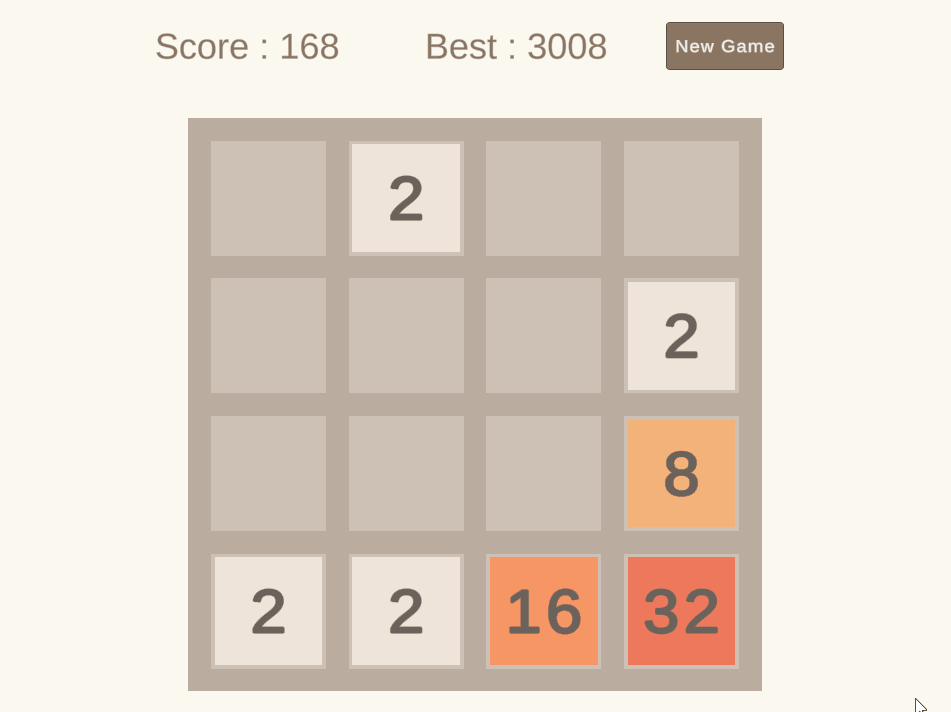
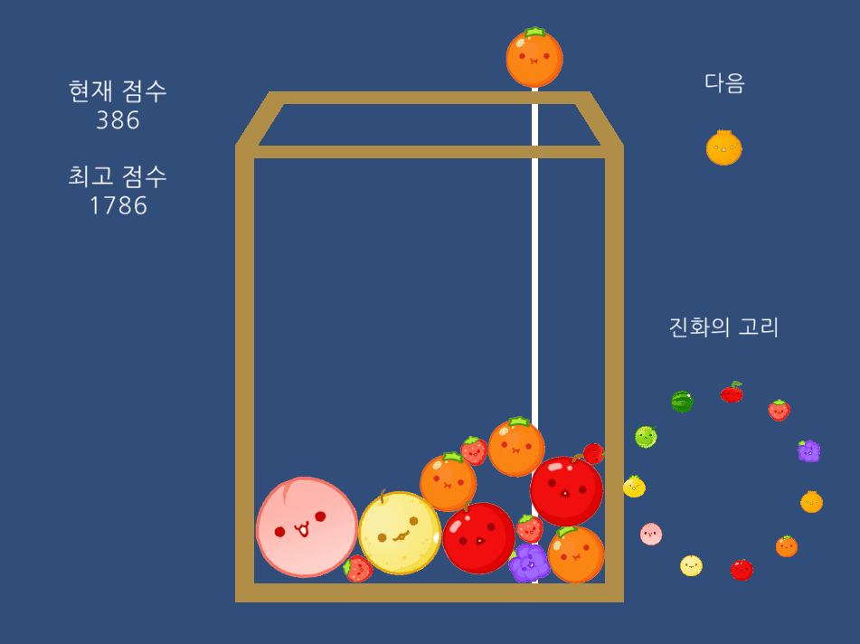
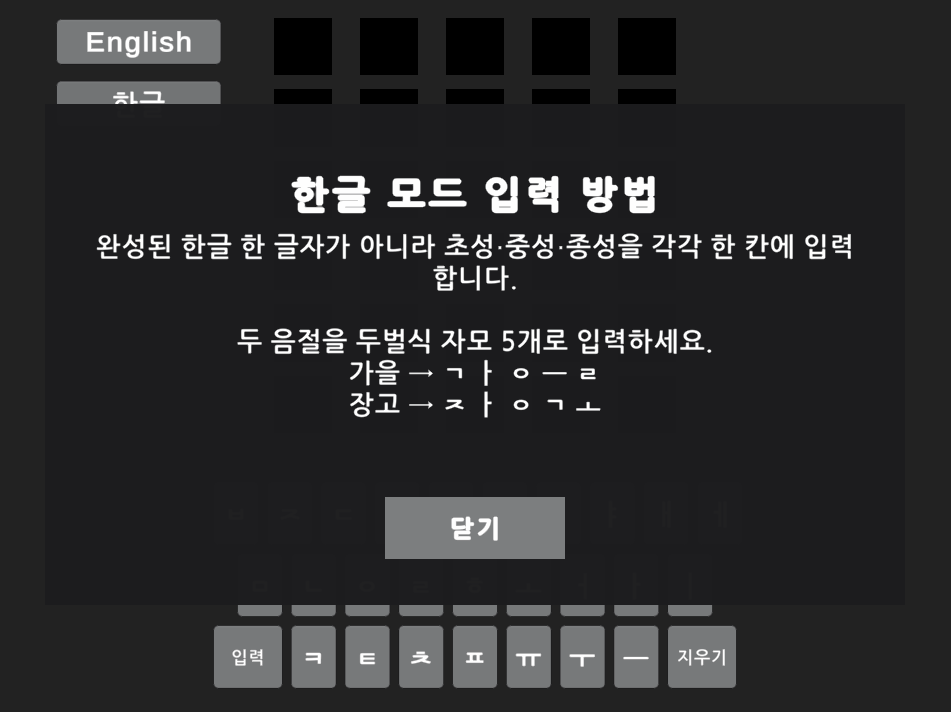
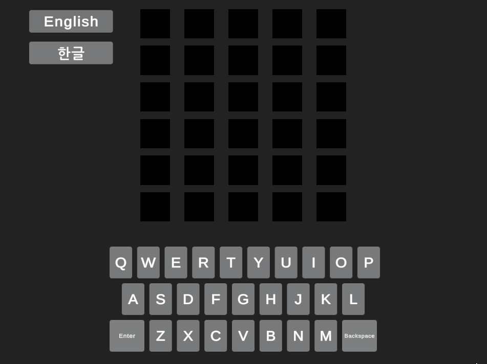
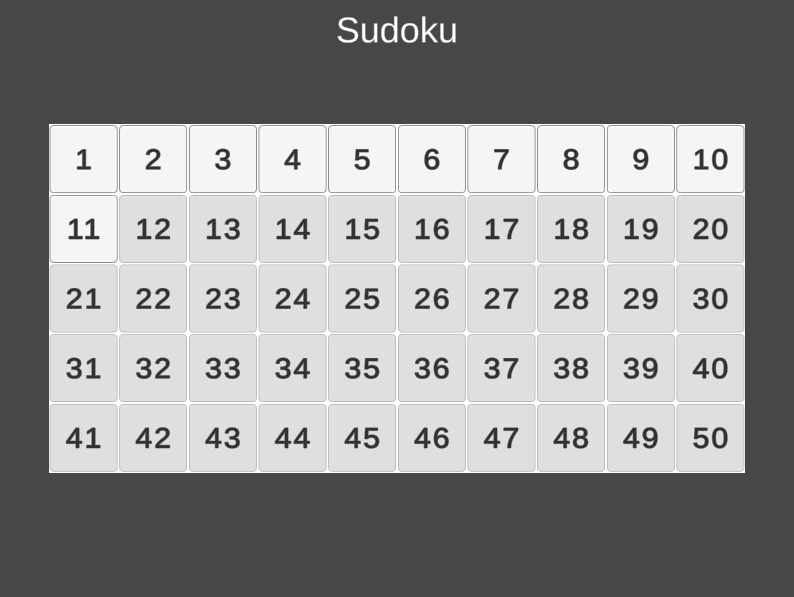

# Unity Clone Game Collection

기존 게임의 핵심 규칙을 분석하고 Unity와 C#으로 구현한 개인 학습 프로젝트 모음입니다. 각 폴더에는 프로젝트 개요와 핵심 로직을 담았으며, 하나의 GitHub Pages 사이트에서 게임별 주소로 실행할 수 있도록 구성했습니다.

## 프로젝트

| 프로젝트 | 개발 시기 | 핵심 구현 | 문서 | 플레이 |
| --- | --- | --- | --- | --- |
| 2048 Clone | 2023.05 | 보드 압축, 1회 병합, 점수 계산, 타일 생성, 게임 오버 판정 | [상세 내용](./2048/) | [WebGL 실행](https://jun-uni.github.io/Unity-Clone-Games/2048/) |
| Suika Game Clone | 2024.01 | 2D 물리 낙하, 동일 과일 병합, 진화 단계, 다음 과일과 점수 표시 | [상세 내용](./Suika/) | [WebGL 실행](https://jun-uni.github.io/Unity-Clone-Games/suika/) |
| Wordle Clone | 2023.05 | 영어·한글 입력, 중복 문자 판정, 사전 검사, 6회 시도 | [상세 내용](./Wordle/) | [WebGL 실행](https://jun-uni.github.io/Unity-Clone-Games/wordle/) |
| Sudoku Clone | 2023.06 | 완성 보드 생성, 유일 해답 검증, 빈칸 수 기반 50개 레벨, 입력과 오답 처리 | [상세 내용](./Sudoku/) | [WebGL 실행](https://jun-uni.github.io/Unity-Clone-Games/sudoku/) |

## 플레이 화면

### 2048 Clone

### Suika Game Clone

### Wordle Clone · 한글 모드

### Wordle Clone · 영어 모드

### Sudoku Clone

